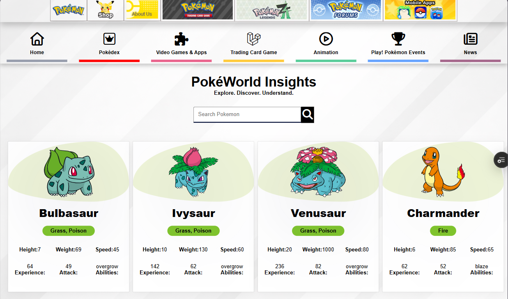

#  Pokedex Web App

A modern and responsive **Pokedex Web Application** built using **React.js** that fetches real-time Pokémon data from the **PokéAPI**. This project was developed as part of my **GDG Frontend Inductions** to demonstrate my understanding of frontend fundamentals, API integration, and UI design.

---

## 🚀 Live Demo

👉 https://poke-dex-o787.vercel.app/

---

## 📌 Features

* 🔍 Browse a list of Pokémon with images and basic details
* ⚡ Real-time data fetching from **PokéAPI**
* 📱 Fully responsive design (mobile & desktop)
* 🎨 Clean and minimal UI
* 🧩 Component-based architecture using React

---

## 🛠️ Tech Stack

* **Frontend:** React.js, JSX
* **Styling:** CSS3 / Flexbox
* **API:** [PokéAPI](https://pokeapi.co/)
* **Deployment:** Vercel
* **Version Control:** Git & GitHub

---

## 📂 Project Structure

```
pokedex-web/
│── src/
│   ├── components/
│   │   ├── Header.jsx
│   │   ├── Pokemon.jsx
│   │   ├── Footer.jsx
│   │   ├── Navbar.jsx
│   ├── App.jsx
│   ├── app.css
│   ├── main.jsx
│   ├── Pokemon.jsx
│── public/
│── package.json
```

---

## ⚙️ How It Works

* The app fetches Pokémon data using **fetch API** from PokéAPI
* Data is stored and managed using **React state & hooks**
* Pokémon cards are rendered dynamically using `.map()`
* Components are reused to keep the code clean and modular

---

## 🧠 Concepts Used

* React Functional Components
* Props & State
* Hooks (`useEffect`)
* API Fetching & Async/Await
* Responsive Design
* Component Reusability

---

## 🧪 Installation & Setup

1. Clone the repository

```bash
git clone https://github.com/mahisingh06330-arch/PokeDex.git
```

2. Navigate to the project folder

```bash
cd Pokedex
```

3. Install dependencies

```bash
npm install
```

4. Start the development server

```bash
npm run dev
```

---

## 🎯 Purpose of the Project

This project was built to:

* Strengthen my **React.js fundamentals**
* Learn **API integration** and data handling
* Practice **clean UI/UX design**
* Showcase my skills for **GDG frontend inductions**

---

## 📸 Screenshots

### 🏠 Home Page


### 📱 Mobile View


---

## 👨‍💻 Author

**Mahi Singh Sengar**
Frontend Developer | React Enthusiast

---
